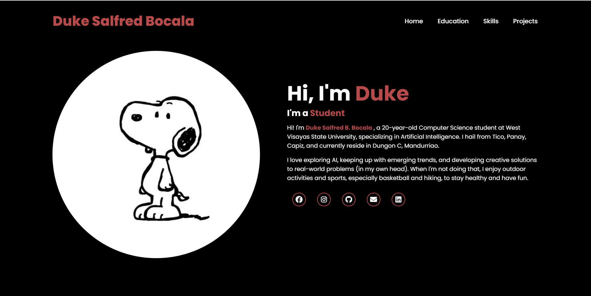

# 🌟 Duke's Portfolio  

Welcome to my personal portfolio website — a digital space where I showcase my background, education, skills, and projects.  
Live Demo: **[portfolio-ruddy-two-48.vercel.app](https://portfolio-ruddy-two-48.vercel.app/)**  

---

## 📖 About
This portfolio was built to highlight my journey as a Computer Science student and aspiring software developer.  
It serves as both a **resume hub** and a **project gallery**, allowing visitors to learn more about my academic background, technical expertise, and the work I’ve created.  

⚠️ **Note:** This portfolio is a continuous work in progress.  
It is **subject to change and improvement over time** as I gain new experiences, learn new technologies, and refine my skills.  

---

## 🚀 Features
- 🏠 **Home Section** – A warm introduction with my photo and social links.  
- 🎓 **Education Section** – Highlights of my academic path with clickable logos.  
- 🛠 **Skills Section** – Animated skill bars to demonstrate proficiency.  
- 💻 **Projects Section** – A visual showcase of my projects with hover effects and detailed previews.  
- 📱 **Responsive Design** – Works seamlessly across desktops, tablets, and mobile devices.  
- ✨ **Animations** – Smooth content reveals powered by ScrollReveal.js.  

---

## 🛠️ Tech Stack
- **Frontend:** HTML5, CSS3, JavaScript (ES6)  
- **UI/UX:** Responsive design, animations, Font Awesome icons, Google Fonts  
- **Deployment:** [Vercel](portfolio-ruddy-two-48.vercel.app)  

---

## 📂 Folder Structure

---

## 📸 Preview
  

---

## 👤 Author
**Duke Salfred Bocala**  
- 🌐 [GitHub](https://github.com/conqueror-pizza)  
- 💼 [LinkedIn](https://www.linkedin.com/in/duke-salfred-b-53435b380/)  
- 📘 [Facebook](https://www.facebook.com/duke.salfred.bocala.2025)  
- 📷 [Instagram](https://www.instagram.com/duke_hyou_/)  

